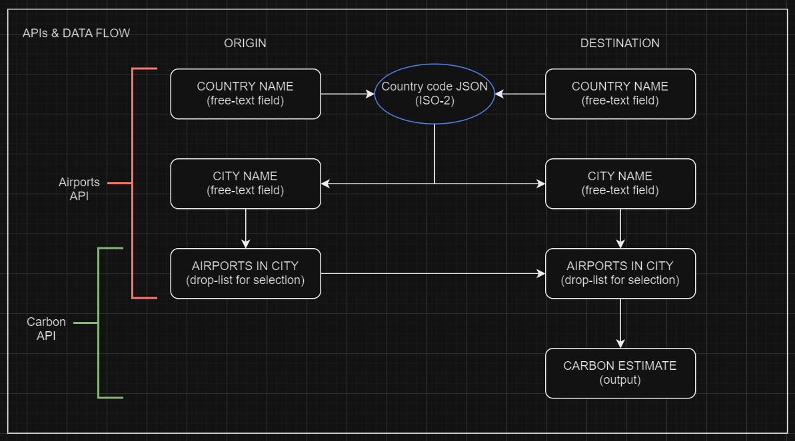

# Flight Carbon Tracker

This is a form where users can select their origin and destination based on several perimeters to get a carbon emission value for their flights. 

***

## Screenshots
#### Flight Entries List

#### Flight Details from Airtable

#### Flight Input Form

#### Favourite Airlines
 

***
##Technologies Used
* Javascript
* JSON 
* React JS 

***
##Process
#### UI Sketch (Figma)


#### API Use (Draw.io)


***
####Favourites
Trying Regex to manipulate data from API to pass into another API
```
const iso2Code = selectedDepartureCountry.match(/\((.*?)\)/)[1];
```
```
const extractCountryData = (data) => {
    const uniqueCountries = {}; 
    const accentedCharRegex = /[\u0300-\u036f]/; // regex to remove all diacritical marks 

    data.forEach(item => {
        const countryName = item.label_en.split(/:|,/)[0].trim(); 
        const iso2Code = item.iso2_code || ''; // Extract ISO 2-letter code or use empty string if not available

        if (!accentedCharRegex.test(countryName)) {
            uniqueCountries[countryName]=iso2Code
        }
    })

    return Object.keys(uniqueCountries)
        .map(label_en => ({ label_en: `${label_en} (${uniqueCountries[label_en]})` }))
        .sort((a,b) => a.label_en < b.label_en ? -1 : (a.label_en > b.label_en ? 1 : 0)) ...
```
Appreciate the power of useEffect 
```
    useEffect(() => {
        const fetchData = async () => {
            try {
                if (isOpen && entryId) {
                    const entry = await fetchAirtableEntry(entryId);
                    const { fields, createdTime } = entry;

                    setEntryTitle(fields.entryTitle || "");
                    setDepartureCountry(fields.departureCountry || "");
                    setDepartureCity(fields.departureCity || "");
                    setDepartureAirport(fields.departureAirport || "");
                    setDestinationCountry(fields.destinationCountry || "");
                    setDestinationCity(fields.destinationCity || "");
                    setDestinationAirport(fields.destinationAirport || "");
                    setCreatedTime(createdTime || "");
                    setEstimatedEmission(fields.estimatedEmission || "");
                }
            } catch (error) {
                console.error("Error fetching entry from Airtable", error);
            }
        };

        fetchData();
    }, [isOpen, entryId]);
    ```
    ***
    ##Challenges Face 
    1. Project folder is large and increasingly confusing - how to structure project components
    2. CRUD - particularly Update - Unable to fetch all re-populate all fields in reusable form
    ```
        useEffect(() => {
    const fetchInitialData = async () => {
           try {
                const data = await fetchAirtableEntry(entryId);
                if (data.fields) {
                    setInitialData({
                        entryTitle: data.fields.entryTitle || "" , 
                        departureCountry: data.fields.departureCountry, 
                        departureCity: data.fields.departureCity, 
                        departureAirport: data.fields.departureAirport,
                        destinationCountry: data.fields.destinationCountry, 
                        destinationCity: data.fields.destinationCity, 
                        destinationAirport: data.fields.destinationAirport
                    })
                }
              console.log(data)  
            } catch (error) {
                console.error('Error fetching initial data:', error)
            } finally {
                setLoading(false); 
            }
        }
        if (isOpen) {
        fetchInitialData()
        } 
    }, [isOpen, entryId])


    const handleUpdate = (updatedFormData) => {
        editAirtableEntry() 
        console.log('Updated form data', updatedFormData)
    }
    ```
    3. Using more than one APIs in consecutive manner
    ```
    // Fetch cities when departure country is selected

    useEffect(() => {
        if (selectedDepartureCountry) {
            fetchCities(selectedDepartureCountry)
            .then(cities => setDepartureCities(cities))
            .catch(error => console.error('Error fetching departure cities:', error))
        } else {
            setDepartureCities([]); // Clear cities when no country is selected
        }
    }, [selectedDepartureCountry]);
    
// Departure country state change

    const handleDepartureCountryChange = (e) => {
        const value = e.target.value
            setSelectedDepartureCountry(value);
            setFormData((prevFormData) => ({
                ...prevFormData,
                departureCountry: value,
                departureCity: '',
                departureAirport: '', 
            }))
    };

//.......................................................................
// Fetch cities when destination country is selected

      useEffect(() => {
        if (selectedDestinationCountry) {
            fetchCities(selectedDestinationCountry)
            .then(data => setDestinationCities(data))
            .catch(error => console.error('Error fetching destination cities:', error))
        } else {
            setDepartureCities([]); // Clear cities when no country is selected
        }
    }, [selectedDestinationCountry]);
    ```
***
## Things I learned 
1. Plan project components down to detail AT THE START
2. Reinforced destructuring assignment vs Object Literal assigment
```
Look very similar but serve very different functions
const {fields, createTime} = entry
!=
const entry = {field, createdTime}
```
3. Naming consistency - carbonKg vs estimatedEmissions
```
const carbonKg = response.data.data.attributes.carbon_kg; // Error here 
console.log("Carbon kg:", carbonKg);
return carbonKg;
const estimatedEmission = response.data.data.attributes.carbon_kg; // Error here 
console.log("Carbon kg:", estimatedEmission);
return estimatedEmission;
```
4. A simple useEffect block can make a BIG difference to the app
```
Empty dependency array to control render once only on mounting. 
Saves lots of API calls and make app more performant. 
useEffect(() => {
    async function fetchEntries() {
        const data = await fetchAirtableEntries();
        setEntries(data);
    }
    fetchEntries();
}, []);
```
5. How API requests are structured based on how data is structured
```
Makes or breaks the request
--data '{
    "records": [
      {
        "fields": {...
```
***
##Next Steps
1. Many steps
2. Fix the problems newly created 
3. Make CRUD functional
***
##Attributions
* Waihon - for all the advice, hours spent on refreshing concepts and troubleshooting
* [ChakraUI](https://v2.chakra-ui.com/getting-started) 
* [MaterialUI](https://mui.com/)
* [OpenDataSoft API](https://public.opendatasoft.com/api/explore/v2.1/console)
* [Carbon Interface API](https://docs.carboninterface.com/#/?id=estimates-api)
* [API Ninjas API](https://api-ninjas.com/api/airports)
* [Airtable](https://support.airtable.com/docs/getting-started-with-airtable)
